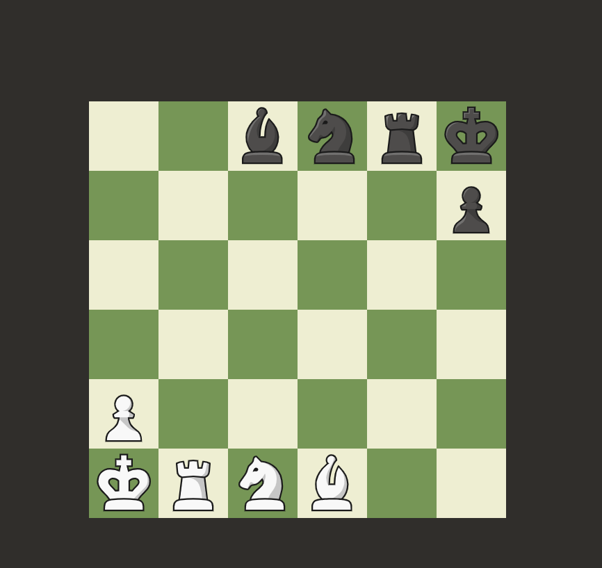

# Chessmihouse 6×6 - Cờ vua 6×6 với luật Crazyhouse



## Giới thiệu

Chessmihouse 6×6 là một biến thể thú vị của cờ vua truyền thống, được phát triển bởi Trần Thái Dương, Vũ Văn Hà Công và Lê Trung Kiên. Trò chơi kết hợp bàn cờ 6×6 nhỏ gọn với luật thả quân (Crazyhouse), tạo nên trải nghiệm chiến thuật độc đáo và nhanh nhẹn hơn phiên bản cờ vua 8×8 truyền thống.

### Đặc điểm nổi bật:
- **Bàn cờ 6×6**, nhỏ gọn hơn so với cờ vua tiêu chuẩn
- **Luật Crazyhouse** cho phép thả lại quân đã bị bắt
- **AI đối thủ** được tích hợp sẵn với nhiều cấp độ
- **Giao diện người dùng** hiện đại, thân thiện và dễ sử dụng
- **Hiệu ứng âm thanh** sống động

## Luật chơi

### Bàn cờ và quân cờ:
- **Bàn cờ 6×6** thay vì 8×8 như cờ vua truyền thống
- **Mỗi bên** có 1 Vua, 1 Xe, 1 Mã, 1 Tượng và 1 Tốt khi bắt đầu

### Luật di chuyển:
- **Vua**: Di chuyển 1 ô theo mọi hướng
- **Xe**: Di chuyển theo hàng ngang và dọc
- **Mã**: Di chuyển theo hình chữ L (2-1)
- **Tượng**: Di chuyển theo đường chéo
- **Tốt**: Di chuyển 1 ô về phía trước, bắt quân theo đường chéo

### Luật Crazyhouse:
- Khi bắt được quân của đối thủ, quân đó sẽ đổi màu và được thêm vào "ngân hàng quân" của bạn
- Bạn có thể thả quân từ ngân hàng vào bàn cờ trong lượt đi của mình
- Không được thả Tốt vào hàng cuối
- Tốt có thể phong cấp thành Xe, Mã hoặc Tượng khi đến hàng cuối

### Kết thúc trận đấu:
- **Chiếu bí**: Vua đối phương bị chiếu mà không có nước đi hợp lệ nào để thoát
- **Hòa cờ**: Người chơi đến lượt không còn nước đi hợp lệ nào nhưng vua không bị chiếu

## Cài đặt và chạy dự án

### Yêu cầu hệ thống:
- Node.js (v18.0.0 trở lên)
- Bun hoặc npm

### Bước 1: Clone dự án
```bash
git clone https://github.com/yourusername/tiny-chess-variant-45.git
cd tiny-chess-variant-45
```

### Bước 2: Cài đặt các phụ thuộc
```bash
# Sử dụng Bun (khuyến nghị)
bun install

# Hoặc sử dụng npm
npm install
```

### Bước 3: Chạy ứng dụng ở chế độ phát triển
```bash
# Sử dụng Bun
bun dev

# Hoặc sử dụng npm
npm run dev
```

### Bước 4: Build ứng dụng cho môi trường production
```bash
# Sử dụng Bun
bun run build

# Hoặc sử dụng npm
npm run build
```

## Công nghệ sử dụng

- **React**: Thư viện JavaScript để xây dựng giao diện người dùng
- **TypeScript**: Ngôn ngữ lập trình tĩnh được biên dịch thành JavaScript
- **Vite**: Công cụ build nhanh cho ứng dụng web hiện đại
- **Tailwind CSS**: Framework CSS tiện dụng
- **Framer Motion**: Thư viện animation cho React
- **Sonner**: Thư viện thông báo (notifications)
- **shadcn/ui**: Bộ components UI có thể tái sử dụng
- **Stockfish.js**: Engine cờ vua cho AI

## Cấu trúc dự án

```
src/
├── components/          # Các thành phần UI của ứng dụng
│   ├── ChessBoard.tsx   # Thành phần bàn cờ chính
│   ├── ChessPiece.tsx   # Thành phần quân cờ
│   ├── PieceBank.tsx    # Thành phần ngân hàng quân
│   ├── GameInfo.tsx     # Hiển thị thông tin trận đấu
│   ├── GameControls.tsx # Các nút điều khiển trò chơi
│   ├── MoveHistory.tsx  # Lịch sử nước đi
│   └── ui/              # Các thành phần UI cơ bản
├── lib/                 # Thư viện và logic trò chơi
│   ├── chess-logic.ts   # Logic cờ vua cốt lõi
│   ├── chess-models.ts  # Các model dữ liệu
│   ├── chess-ai.ts      # Logic AI
│   └── chessengine/     # Tích hợp chess.js
├── hooks/               # Custom React hooks
├── pages/               # Các trang của ứng dụng
└── types/               # Các định nghĩa kiểu dữ liệu
```

## Người phát triển

### Trần Thái Dương
- **Vai trò**: Frontend Developer, Game Logic,Thuật toán đánh giá quân cờ.


### Vũ Văn Hà Công
- **Vai trò**: Frontend Developer, UI/UX Designer,Thuật toán đánh giá thả quân.

### Lê Trung Kiên
- **Vai trò**: Full-stack Developer, Integration Specialist,Game Logic

## Tính năng trong tương lai

- [ ] Chế độ chơi nhiều người (multiplayer)
- [ ] Bảng xếp hạng và hệ thống ELO
- [ ] Thêm biến thể cờ vua khác
- [ ] Tùy chỉnh giao diện và themes
- [ ] Phát triển cho nền tảng di động
- [ ] Hỗ trợ đa ngôn ngữ

## Giấy phép

© 2025 Trần Thái Dương, Vũ Văn Hà Công, Lê Trung Kiên. All rights reserved.


Chessmihouse 6×6 - Cờ vua nhỏ, trí tuệ lớn!
## Link Sử Dụng:  https://congkcks.github.io/tiny-chess-variant-45/
